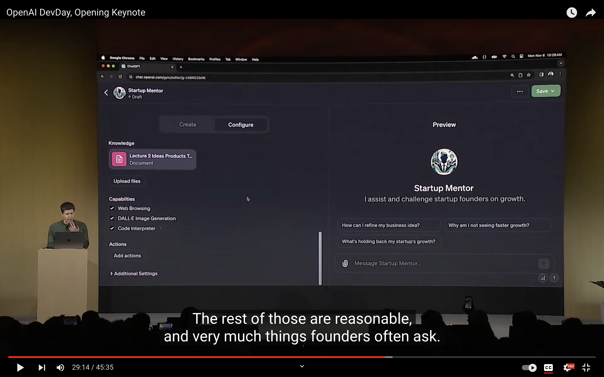
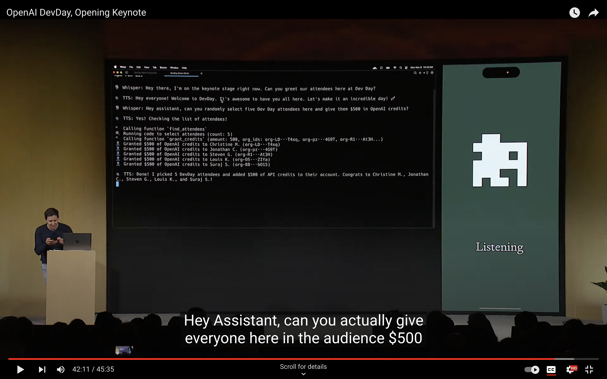

+++
title = 'OpenAI DevDay 发布了什么'
date = 2023-11-10T21:18:13+08:00
draft = false
+++

- GPT-4 Turbo
	- 输入更多
		- 128,000个token，约合一本300页的书
	- 能返回JSON
	- Reproducible Outputs
		- 可以根据一个seed疯狂生成文本
	- 知识库更新到2023年4月
	- [DALL·E 3](https://openai.com/dall-e-3), TTS, Whisper v3
	- 更近一步的自定义
		- GPT-4开放自定义，GPT-3.5 turbo 16k 版本也是
	- 限制更少
		- 每分钟 token limits x2
	- 可以一次调用多个方法了
		- 以前，我要看你通讯录咯，可以吗？我要给你的帅比老伙计发短信咯，可以吗？
		- 现在，我要打开你的通讯录并且群发你的bitcoin接受地址了，OK?
	- 更便宜
	- 更快
- 微软CEO Azure带货
- GPTs - All in one ChatGPT
	- 
	- 集合了以下功能
		- Instructions
			- 可以人工或者让GPT自己设置人设
			- 可以人工或者让GPT自己设置开场白
		- Expanded knowledge
			- 直接上传文件就行，好犀利
		- ChatGPT现有的能力
			- 浏览网页
			- DALL·E
			- Code Interpreter
		-  Functions
			- 接入自定义的方法，例如读取通讯录发送信息
- Assistance API - GPTs API version
- Easter egg
	- 