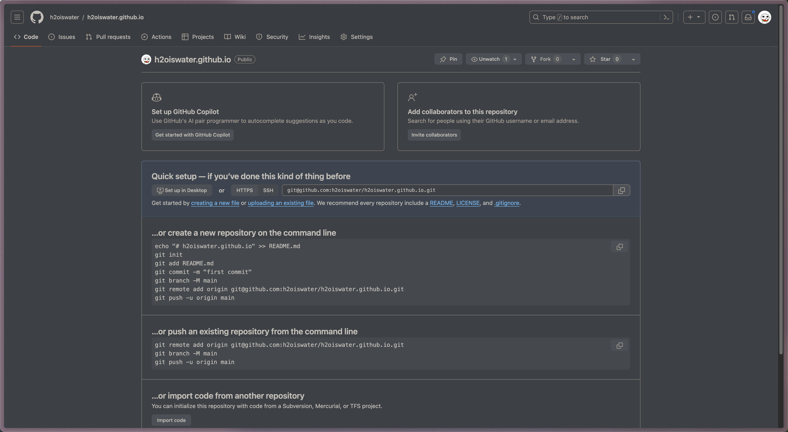

+++
title = 'Reconnect'
date = 2023-11-10T19:27:02+08:00
draft = false
+++

给自己看的博客操作指南

## 1. 初始化

1. Github新建一个和Repo，名字是`自己的用户名.github.io`。
	1. 
2. 安装 [Hugo](https://gohugo.io/)  `brew install hugo`
3. 初始化博客
	1. `hugo new site reconnect`
	2. `git init`
4. 安装主题
	1. 去`https://themes.gohugo.io/`挑一个主题
	2. 通过submodule的方式引入主题`git submodule add --depth=1 https://github.com/adityatelange/hugo-PaperMod.git themes/PaperMod`
		1. 新clone项目时如果没有submodule就手动更新`git submodule update --init --recursive`

# 2. 写

# 3. 部署

- 部署到Cloudflare Pages
	- 提交代码到Github
		- `git remote add origin git@github.com:h2oiswater/h2oiswater.github.io.git`
		- `git branch -M main`
		- `git add .`
		- `git commit -m"chore: init`
		- `git push -u origin main`
	- Deploy with Cloudflare Pages
		- [ref](https://developers.cloudflare.com/pages/framework-guides/deploy-a-hugo-site/#deploy-with-cloudflare-pages)

